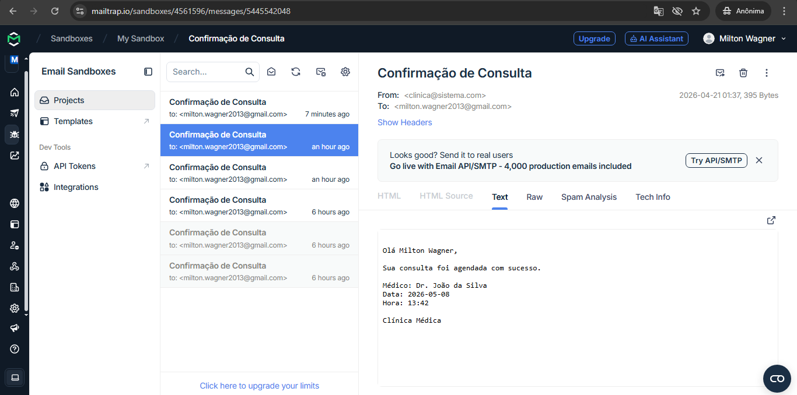

# 📸 Imagens do Sistema

## 🏠 Tela Inicial


## 🔐 Tela de Login


## 📋 Menu Principal


## 📅 Agendamento de Consulta


## 📊 Lista de Consultas


## 👤 Cadastro de Pacientes


## 📧 Confirmação de Email



# 🏥 Sistema de Gestão de Clínica Médica (SGHSS)

## 👨‍💻 Grupo de Projeto Integrador (PI)

* Adriel Rattes Cortez
* Fernando Dias Araujo
* Giuliano Oliveira da Silva
* Milton Wagner Filho
* Paulo Ricardo de Camargo
* Riquelme Eduardo Previtale Gomes

---

# 📌 Visão Geral do Projeto

Este projeto apresenta o desenvolvimento de um Sistema Web para Gestão de Clínica Médica, 
concebido com base em princípios sólidos de engenharia de software, arquitetura em camadas 
e boas práticas de desenvolvimento.

O sistema foi projetado para simular um ambiente real de clínica médica, contemplando desde 
o cadastro de pacientes até o gerenciamento completo de consultas, incluindo notificações 
automatizadas.

---

# 🎯 Objetivo Acadêmico e Técnico

O objetivo deste projeto é consolidar conhecimentos nas seguintes áreas:

* Desenvolvimento Web com Python
* Arquitetura MVC
* Persistência de dados com ORM
* Boas práticas de organização de código
* Integração de serviços externos (email)

Além disso, busca-se entregar uma aplicação funcional com características próximas a 
sistemas utilizados no mercado.

---

# 🧱 Stack Tecnológica

| Tecnologia | Finalidade                           |
| ---------- | ------------------------------------ |
| Python     | Linguagem principal                  |
| Flask      | Framework web leve e modular         |
| SQLAlchemy | ORM para abstração do banco de dados |
| SQLite     | Banco de dados relacional            |
| Bootstrap  | Padronização visual e responsividade |
| HTML / CSS | Estrutura e estilização              |
| Jinja2     | Template engine                      |
| Git        | Versionamento de código              |

---

# 🏗️ Arquitetura e Organização

O sistema foi estruturado seguindo o padrão **MVC (Model-View-Controller)**, garantindo:

* Separação de responsabilidades
* Manutenibilidade
* Escalabilidade

### 📂 Organização do Projeto

* `models/` → definição das entidades e regras de persistência
* `controllers/` → lógica de negócio e controle de rotas
* `templates/` → camada de apresentação (Jinja2)
* `static/` → arquivos estáticos (CSS, imagens)
* `utils/` → serviços auxiliares (email e lembretes)

### 🗂 Estrutura Completa do Projeto

ProjetoClinicaMedica/
│
├── app.py
├── extensions.py
│
├── models/
│   ├── __init__.py
│   ├── paciente.py
│   ├── medico.py
│   └── consulta.py
│
├── controllers/
│   ├── paciente_controller.py
│   └── consulta_controller.py
│
├── templates/
│   ├── base.html
│   ├── index.html
│   ├── login.html
│   ├── menu.html
│   ├── pacientes.html
│   ├── consultas.html
│   ├── agendar.html
│   └── reagendar.html
│
├── static/
│   ├── css/
│   │   └── style.css
│   └── img/
│       ├── clinica.jpg
│       └── logo.jpg
│
├── utils/
│   ├── email_servi

# ⚙️ Funcionalidades Implementadas

## 🔐 Autenticação
- Sistema de login com controle de sessão
- Proteção de rotas

## 🧑‍⚕️ Gestão de Pacientes
- Cadastro de pacientes
- Listagem dinâmica
- Exclusão com confirmação

## 👨‍⚕️ Gestão de Médicos
- Cadastro automático (seed)
- Associação com especialidades

## 📅 Agendamento de Consultas
- Seleção de paciente
- Seleção de médico com especialidade
- Escolha de data e hora
- Interface com lista dinâmica e scroll

## 📋 Painel de Consultas
- Visualização estruturada
- Relacionamento paciente ↔ médico
- Exclusão de consultas

## 🔗 Relacionamentos (ORM)
- Uso de `ForeignKey`
- Uso de `relationship`
- Navegação entre objetos (consulta.paciente, consulta.medico)

## 📧 Notificações por Email
- Integração com Mailtrap
- Envio de confirmação de consulta

## ⏰ Lembretes Automatizados
- Verificação de consultas futuras
- Disparo automático de notificações

---

# 📋 Requisitos Atendidos

| Requisito | Status |
|----------|--------|
| Painel de Agendamento | ✔ Implementado |
| Calendário (data/hora) | ✔ Implementado |
| Seleção de médico/especialidade | ✔ Implementado |
| Cadastro de paciente | ✔ Implementado |
| Confirmação por email | ✔ Implementado |
| Lembretes | ✔ Implementado |
| Cancelamento/Reagendamento | ✔ Implementado |

---

# 🚀 Execução do Projeto

## Instalação
```bash
pip install flask flask_sqlalchemy
````

## Execução

```bash
python app.py
```

## Acesso

```
http://127.0.0.1:5000
```

---

# 🔐 Credenciais de Acesso

Usuário: `admin`
Senha: `123`

---

# 📧 Configuração de Email (Mailtrap)

Para ativar o envio de e-mails:

1. Criar conta no Mailtrap
2. Obter credenciais SMTP
3. Configurar em:

```
utils/email_service.py
```

---

# 📈 Avaliação Técnica do Projeto

O sistema demonstra:

* Uso correto de ORM (SQLAlchemy)
* Aplicação de arquitetura MVC
* Organização modular
* Separação clara de responsabilidades
* Integração com serviços externos

Trata-se de uma implementação consistente para nível acadêmico, com aproximação de 
práticas reais de mercado.

---


